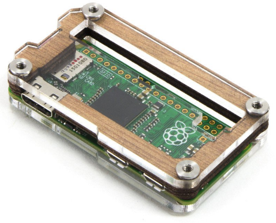

[](https://travis-ci.org/function61/pi-security-module)
[](https://bintray.com/function61/pi-security-module/main/_latestVersion)

What is this?
-------------

Software for a separate trusted hardware device ("hardware security module") which
essentially acts just like [Keepass](http://keepass.info/) and only serves the
function of storing secrets.

If you use Keepass on your PC and your PC gets compromised by a virus or a hacker,
it's game over.

If you use a separate device for storing secrets, your PC compromise does not
expose your secrets. This software only exposes your secret when you physically
press a button on the device - and only exposes one secret per push acknowledge.


Download & running
------------------

Click the "Download" badge at top of this readme, locate the version you want (probably the latest),
click on "Files" tab and download both the binary for your OS/arch combo AND the `public.tar.gz`.

Additionally, you can do this from command line directly on your Pi:

```
$ mkdir pi-security-module/
$ cd pi-security-module
$ curl --fail --location -o pism <url to pism_linux-arm from Bintray>
$ curl --fail --location -o public.tar.gz <url to public.tar.gz from Bintray>

# mark the binary executable
$ chmod +x pism
```

Installation & running:

```
# this only writes a Systemd unit file
$ sudo ./pism install

# configure Systemd to start this on system reboots
$ sudo systemctl enable pi-security-module

# start it manually (reboot would have the same effects)
$ sudo systemctl start pi-security-module

# check logs for succesful start
$ sudo systemctl status pi-security-module
Mar 19 12:44:52 raspberrypi systemd[1]: Started Pi security module.
Mar 19 12:44:52 raspberrypi pism[15626]: 2018/03/19 12:44:52 extractPublicFiles: extracting public files from public.tar.gz
Mar 19 12:44:53 raspberrypi pism[15626]: 2018/03/19 12:44:53 Starting in port 80
```

Looks good. You should now be able to access the web interface at `http://<ip of your pi>`.


Features
--------

- Supported secrets:
	* Passwords
	* OTP tokens (Google Authenticator)
	* SSH keys (via SSH agent protocol)
- Create, view and list secrets in a folder hierarchy.
- Export database to Keepass format (for viewing in mobile devices when traveling etc.)
- Import data from Keepass format


Recommended hardware
--------------------



I'm using [Raspberry Zero W](https://www.raspberrypi.org/products/pi-zero-w/)
with [wooden case](https://thepihut.com/products/zebra-zero-for-raspberry-pi-zero-wood)
and a [capacitive pushbutton](http://www.ebay.com/sch/?_nkw=ttp223).

It doesn't matter much which hardware you use, as long as you don't run anything else on
that system - to minimize the attack surface. For such a light use Raspberry Pi is
economical, although this project runs across processor architectures and operating systems
because Golang is so awesome. :)


Building
--------

```
$ docker build -f Dockerfile.build -t pi-security-module .
$ docker run --rm -it -p 8080:80 -v "$(pwd):/go/src/github.com/function61/pi-security-module" pi-security-module
$ glide install
$ go build
```

(the Docker build container is optional, but it makes everything easier and doesn't install anything in your host system)

Releasing: take a look at `bin/release.sh`


TODO
----

- Tags to .JS command definitions
- Enter to confirm command dialog
- Data types for command fields (password)
